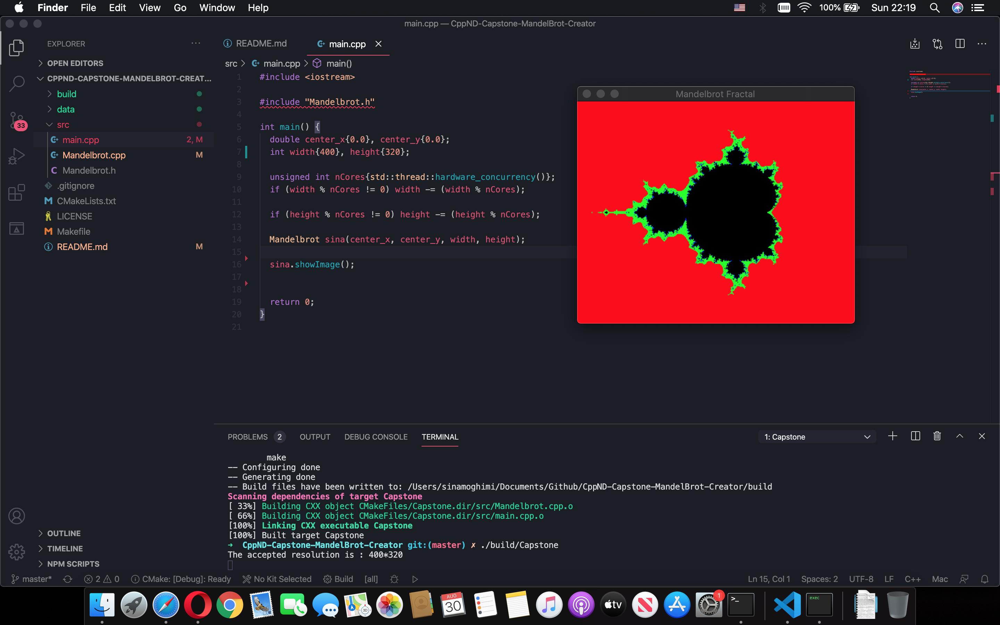

# CPPND: Capstone Mandelbrot Creator

## Mandelbrot Set
Benoit Mandelbrot was a Polish born, French/American mathematician who spent most of his career at the IBM research center in New York. He is credited for coining the term “fractal” and developed a theory of `roughness`/`self- similarity`/`fractals`/`chaos`. His book [The Fractal Geometry of Nature](https://www.amazon.com/Fractal-Geometry-Nature-Benoit-Mandelbrot/dp/0716711869) was published in 1982 and was quite influential at the time (this was when computer graphics were just becoming widely available). One of his inventions/discoveries, the Mandelbrot set has stimulated significant mathematical research and is popularly used to generate interesting visual images (and also test the limits of hardware!). 

To understand the `Mandelbrot set` and another famous set called `Julia Set`, you can visit [here](http://www.math.uchicago.edu/~may/VIGRE/VIGRE2009/REUPapers/Avalos-Bock.pdf) and [here](http://sites.science.oregonstate.edu/~koslickd/Mandelbrot.pdf).

## About the project
This project consists of developing code to draw and explore a certain kind of fractal called a Mandelbrot set. The flow of this project is as follows:

1. Create a 2D vector using `std::vector`, since it is guaranteed to be contiguous and call it `_vec` with size (width*height, std::vector<int> (3, 0)). (One time only!)
2. Create a 2D matrix for the image using `cv::Mat`, to visualize the fractal and call it `_image`. (One time only!)
3. Create a method to calculate the number of iterations for each point in the `_vec` and call it `_iterations`.
4. Create a BGR color creator using `cv::Vec3b`, get the number of _iterations from step 3 and convert it to 3-channel color pixel.
5. Iterate through all indexes of `_vec` and set elements like (i, x, 0) considering the fact that C++ is `Row-major order`. (One time only!) 
6. Create `n` vectors with size : `_vec.size()/n` and fill them with addresses of `_vec` from beginning to end, in order (One time only!). 
7. Pass vectors created in step 6 to other threads using `std::async` and `std::future<void>` to calculate `_iterations` and fill their corresponding index like (i, x, _iterations). (Multiple times during `show image`, `zoom-in` and `zoom-out`).
8. Iterate through all indexes/pixels of `_image`, and set their color using their corresponding `BGR` pixel calculated in step 4.
9. `cv::imshow` the `_image` each time the `zoom-in` or `zoom-out` functions are called.

## Dependencies for Running Locally
* cmake >= 3.7
  * All OSes: [click here for installation instructions](https://cmake.org/install/)
* make >= 4.1 (Linux, Mac), 3.81 (Windows)
  * Linux: make is installed by default on most Linux distros
  * Mac: [install Xcode command line tools to get make](https://developer.apple.com/xcode/features/)
  * Windows: [Click here for installation instructions](http://gnuwin32.sourceforge.net/packages/make.htm)
* OpenCV >= 4.1
  * The OpenCV 4.1.0 source code can be found [here](https://github.com/opencv/opencv/tree/4.1.0)
* gcc/g++ >= 5.4
  * Linux: gcc / g++ is installed by default on most Linux distros
  * Mac: same deal as make - [install Xcode command line tools](https://developer.apple.com/xcode/features/)
  * Windows: recommend using [MinGW](http://www.mingw.org/)

## Basic Build Instructions

1. Clone this repo.
2. Make a build directory in the top level directory: `mkdir build && cd build`
3. Compile: `cmake .. && make`
4. Run it: `./Capstone`.

or simply:

0. You can only use below commands:
* `make debug` for Debug.
* `make build` to build the project.
* `make clean` to remove the build directory.
* `make style` to specify the format you want your code be like.
  * You will need to install `clang-format` first in case it is not installed. You only need to use it once.
  * In macOS you to have `Homebrew` installed. The instructions on how to install, can be found [here](https://brew.sh). Then you can `brew install clang-format`.
  * In Ubuntu or Debian you can `sudo apt install clang-format`.

* `make format` to use the settings of the `style` which in this project is set by default to `-style=google`.
* `make all` to perform almost all the steps above at once.

## Operations
In order to zoom-in or zoom-out the image, you will need to put the mouse pointer on the place you like in the frame.
1. Press button `i` to zoom-in.
2. Press button `o` to zoom-out.

